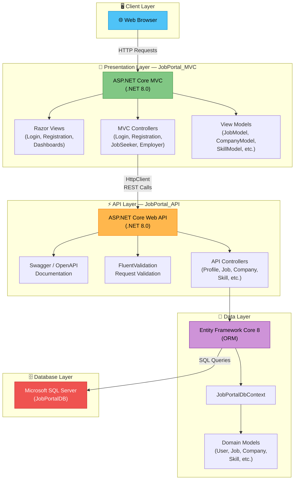
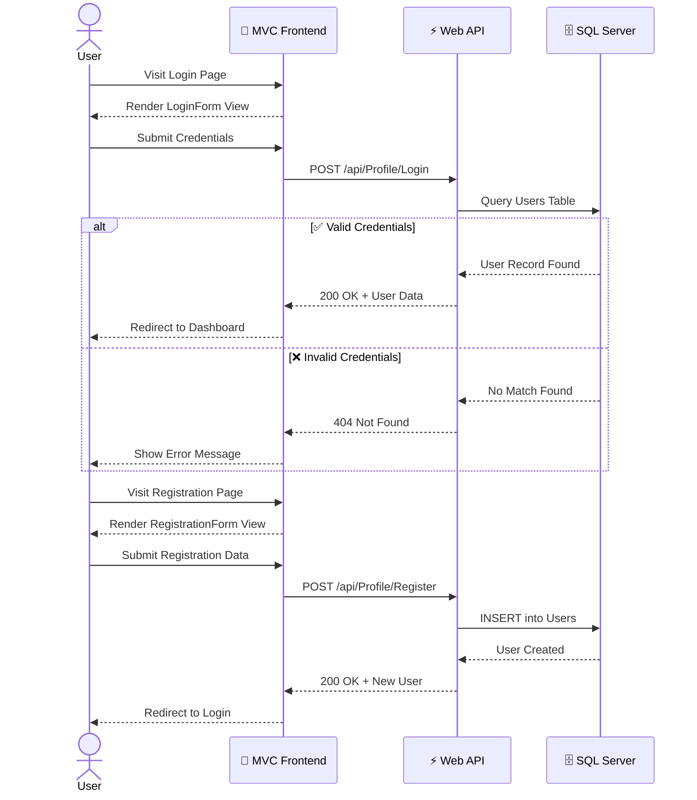
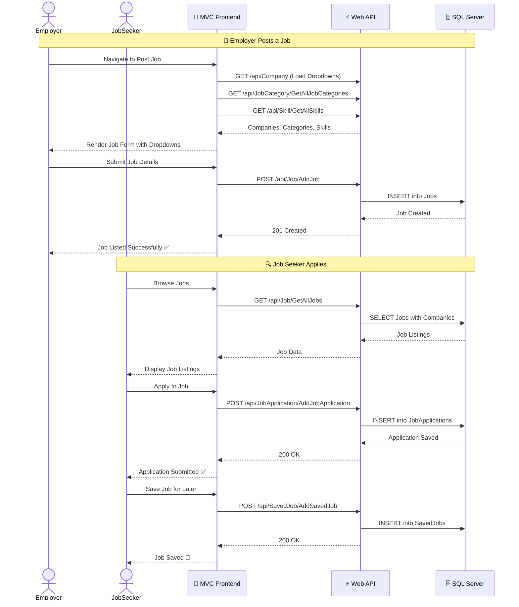
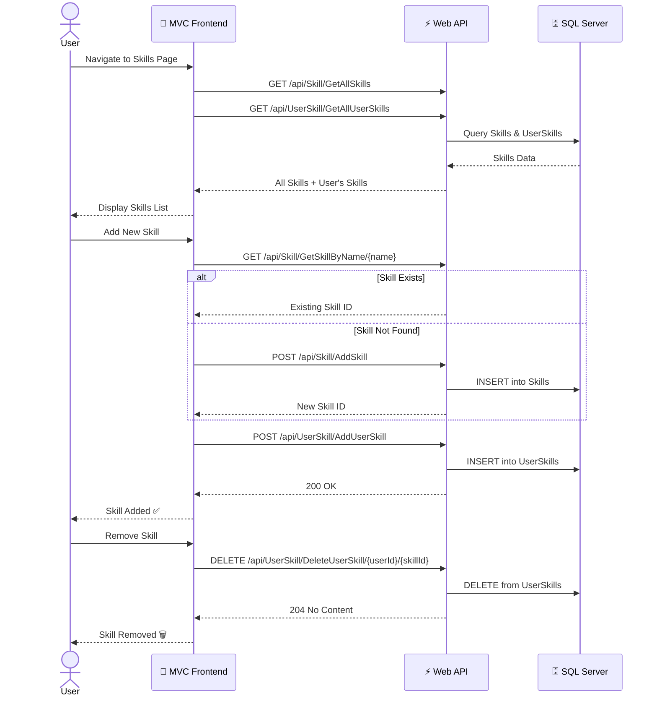
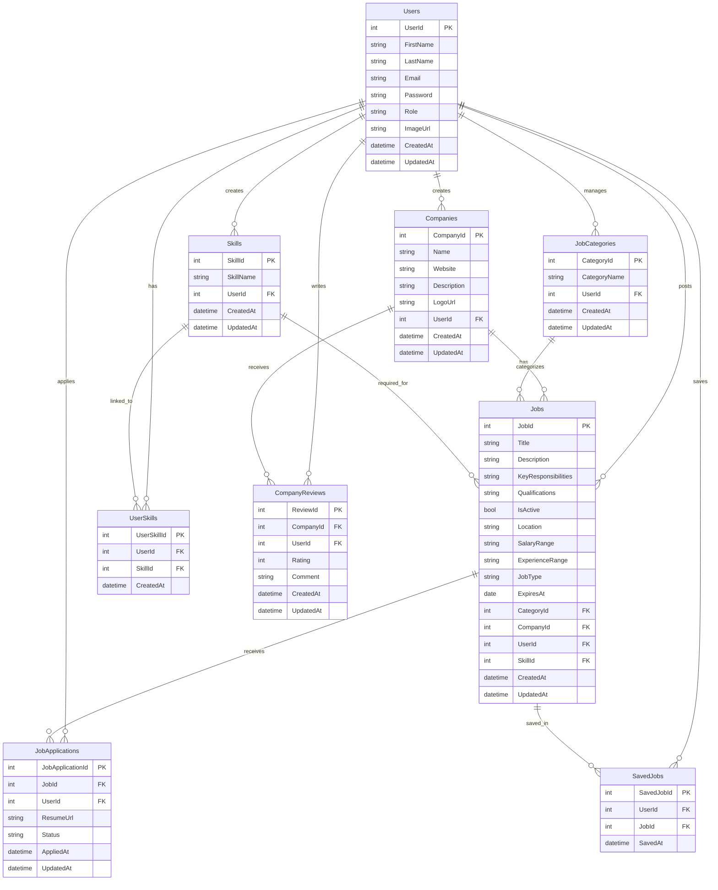
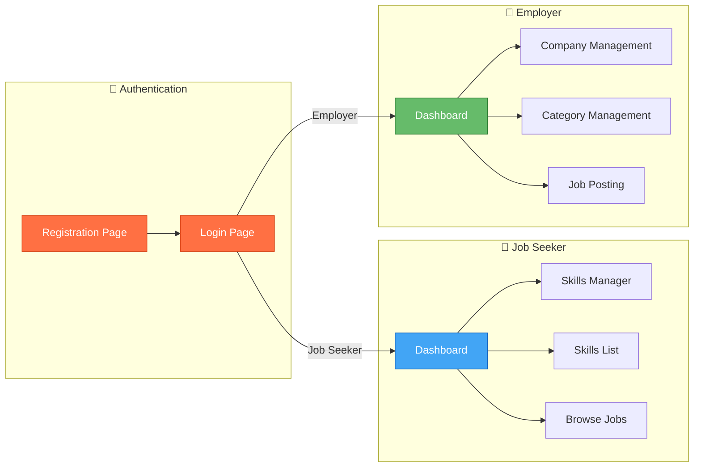

<div align="center">

# 💼 JobPortal

### A Full-Stack Job Portal Application Built with ASP.NET Core 8.0

[](https://dotnet.microsoft.com/)
[](https://www.microsoft.com/sql-server)
[](https://learn.microsoft.com/en-us/ef/core/)
[](https://swagger.io/)
[](LICENSE)

*A modern, feature-rich job portal connecting **Job Seekers** with **Employers** — powered by a robust REST API backend and a clean MVC frontend.*

[🚀 Getting Started](#-getting-started) · [📖 API Reference](#-api-endpoints) · [🏗️ Architecture](#-system-architecture) · [🤝 Contributing](#-contributing)

---

</div>

## 📋 Table of Contents

- [✨ Features](#-features)
- [🏗️ System Architecture](#-system-architecture)
- [🔄 Application Workflow](#-application-workflow)
- [🗄️ Database Schema](#-database-schema)
- [📁 Project Structure](#-project-structure)
- [🛠️ Tech Stack](#-tech-stack)
- [🚀 Getting Started](#-getting-started)
- [📖 API Endpoints](#-api-endpoints)
- [🖥️ MVC Pages & Views](#-mvc-pages--views)
- [🤝 Contributing](#-contributing)

---

## ✨ Features

<table>
<tr>
<td>

### 👤 For Job Seekers
- 🔍 Browse & search job listings
- 📝 Apply to jobs with resume upload
- 💾 Save jobs for later
- 🛠️ Manage personal skills profile
- ⭐ Review companies

</td>
<td>

### 🏢 For Employers
- 📋 Post & manage job listings
- 🏗️ Create company profiles
- 📂 Manage job categories
- 👥 View job applications
- ✏️ Edit & update job postings

</td>
</tr>
<tr>
<td colspan="2">

### ⚙️ Platform Features
- 🔐 User Authentication (Login/Register)
- 🌐 RESTful API with Swagger Documentation
- ✅ FluentValidation for data integrity
- 🗃️ Entity Framework Core with SQL Server
- 📱 Responsive MVC Frontend

</td>
</tr>
</table>

---

## 🏗️ System Architecture



---

## 🔄 Application Workflow

### 🔐 User Authentication Flow



### 💼 Job Posting & Application Flow



### 🛠️ Skills Management Flow



---

## 🗄️ Database Schema



---

## 📁 Project Structure

```
JobPortal/
│
├── 📂 JobPortal_API/                    # ⚡ ASP.NET Core Web API
│   ├── 📂 Controllers/                  # API Controllers
│   │   ├── ProfileController.cs         # 👤 User Registration, Login, Profile
│   │   ├── JobController.cs             # 💼 Job CRUD Operations
│   │   ├── CompanyController.cs         # 🏢 Company CRUD Operations
│   │   ├── JobCategoryController.cs     # 📂 Job Category Management
│   │   ├── JobApplicationController.cs  # 📝 Job Applications + Search
│   │   ├── SkillController.cs           # 🛠️ Skills CRUD Operations
│   │   ├── UserSkillController.cs       # 🔗 User-Skill Mapping
│   │   ├── SavedJobController.cs        # 💾 Saved Jobs CRUD
│   │   └── CompanyReviewController.cs   # ⭐ Company Reviews
│   │
│   ├── 📂 Models/                       # Entity Framework Models
│   │   ├── JobPortalDbContext.cs         # 🗃️ Database Context
│   │   ├── User.cs                      # User Entity
│   │   ├── Job.cs                       # Job Entity
│   │   ├── Company.cs                   # Company Entity
│   │   ├── JobCategory.cs               # Job Category Entity
│   │   ├── JobApplication.cs            # Job Application Entity
│   │   ├── Skill.cs                     # Skill Entity
│   │   ├── UserSkill.cs                 # User-Skill Entity
│   │   ├── SavedJob.cs                  # Saved Job Entity
│   │   └── CompanyReview.cs             # Company Review Entity
│   │
│   ├── Program.cs                       # 🚀 API Entry Point
│   ├── appsettings.json                 # ⚙️ Configuration
│   └── JobPortalAPI.csproj              # 📦 Project File
│
├── 📂 JobPortal_MVC/                    # 🎨 ASP.NET Core MVC Frontend
│   ├── 📂 Controllers/                  # MVC Controllers
│   │   ├── LoginController.cs           # 🔐 Login Page
│   │   ├── RegistrationController.cs    # 📝 Registration Page
│   │   ├── JobSeekerController.cs       # 👤 Job Seeker Dashboard & Features
│   │   └── EmployeerController.cs       # 🏢 Employer Dashboard & Features
│   │
│   ├── 📂 Models/                       # View Models
│   │   ├── JobModel.cs                  # Job View Model
│   │   ├── CompanyModel.cs              # Company View Model
│   │   ├── UserSkillModel.cs            # User Skill View Model
│   │   ├── CompanyReviewsModel.cs       # Reviews View Model
│   │   └── ...                          # Other View Models
│   │
│   ├── 📂 Views/                        # Razor Views
│   │   ├── Login/                       # Login Views
│   │   ├── Registration/                # Registration Views
│   │   ├── JobSeeker/                   # Job Seeker Views
│   │   ├── Employeer/                   # Employer Views
│   │   └── Shared/                      # Layout & Shared Partials
│   │
│   ├── Program.cs                       # 🚀 MVC Entry Point
│   ├── appsettings.json                 # ⚙️ Configuration
│   └── JobPortalMVC.csproj              # 📦 Project File
│
├── JobPortal_Database.ssmssln           # 🗄️ SQL Server Management Studio Solution
└── README.md                            # 📖 This File
```

---

## 🛠️ Tech Stack

| Layer | Technology | Purpose |
|:---:|:---:|:---|
| **Frontend** | ASP.NET Core MVC 8.0 | Razor Views, Server-Side Rendering |
| **Backend API** | ASP.NET Core Web API 8.0 | RESTful API Endpoints |
| **ORM** | Entity Framework Core 8.0 | Database-First Approach |
| **Database** | Microsoft SQL Server | Relational Data Storage |
| **Validation** | FluentValidation 11.3 | Server-Side Input Validation |
| **API Docs** | Swashbuckle (Swagger) 8.1 | Interactive API Documentation |
| **HTTP Client** | IHttpClientFactory | MVC-to-API Communication |
| **Serialization** | Newtonsoft.Json & System.Text.Json | JSON Data Handling |

---

## 🚀 Getting Started

### Prerequisites

| Requirement | Version |
|:---|:---|
| .NET SDK | 8.0 or later |
| SQL Server | 2019+ (or SQL Server Express) |
| Visual Studio | 2022+ (recommended) |
| SQL Server Management Studio | Latest (optional) |

### Installation

**1. Clone the repository**
```bash
git clone https://github.com/Shivam93294Valand/JobPortal.git
cd JobPortal
```

**2. Set up the Database**
- Open SQL Server Management Studio
- Open the `JobPortal_Database.ssmssln` solution file
- Execute the database scripts to create the `JobPortalDB` database

**3. Update Connection String**

Update `JobPortal_API/appsettings.json` with your SQL Server instance:
```json
{
  "ConnectionStrings": {
    "JobPortalDB": "Server=YOUR_SERVER_NAME; Database=JobPortalDB; Trusted_Connection=True; TrustServerCertificate=True;"
  }
}
```

**4. Run the API Project**
```bash
cd JobPortal_API
dotnet restore
dotnet run
```
> 📌 The API will run at `https://localhost:7172` — Swagger UI available at `/swagger`

**5. Run the MVC Project**
```bash
cd JobPortal_MVC
dotnet restore
dotnet run
```
> 📌 The MVC app will launch and connect to the API

---

## 📖 API Endpoints

### 👤 Profile / Authentication

| Method | Endpoint | Description |
|:---:|:---|:---|
| `GET` | `/api/Profile/{userId}` | Get user profile by ID |
| `POST` | `/api/Profile/Register` | Register a new user |
| `POST` | `/api/Profile/Login` | Login with email & password |
| `PUT` | `/api/Profile/Update/{userId}` | Update user profile |

### 💼 Jobs

| Method | Endpoint | Description |
|:---:|:---|:---|
| `GET` | `/api/Job/GetAllJobs` | Get all jobs (with company info) |
| `GET` | `/api/Job/GetJob/{id}` | Get job by ID |
| `POST` | `/api/Job/AddJob` | Create a new job posting |
| `PUT` | `/api/Job/UpdateJob/{id}` | Update an existing job |
| `DELETE` | `/api/Job/DeleteJob/{id}` | Delete a job posting |

### 🏢 Companies

| Method | Endpoint | Description |
|:---:|:---|:---|
| `GET` | `/api/Company` | Get all companies |
| `GET` | `/api/Company/GetCompany/{id}` | Get company by ID |
| `POST` | `/api/Company/AddCompany` | Add a new company |
| `PUT` | `/api/Company/UpdateCompany/{id}` | Update a company |
| `DELETE` | `/api/Company/DeleteCompany/{id}` | Delete a company |

### 📂 Job Categories

| Method | Endpoint | Description |
|:---:|:---|:---|
| `GET` | `/api/JobCategory/GetAllJobCategories` | Get all categories |
| `GET` | `/api/JobCategory/GetJobCategory/{id}` | Get category by ID |
| `POST` | `/api/JobCategory/AddJobCategory` | Create a category |
| `PUT` | `/api/JobCategory/UpdateJobCategory/{id}` | Update a category |
| `DELETE` | `/api/JobCategory/DeleteJobCategory/{id}` | Delete a category |

### 📝 Job Applications

| Method | Endpoint | Description |
|:---:|:---|:---|
| `GET` | `/api/JobApplication/GetAllJobApplications` | Get all applications |
| `GET` | `/api/JobApplication/GetJobApplication/{id}` | Get application by ID |
| `POST` | `/api/JobApplication/AddJobApplication` | Submit an application |
| `PUT` | `/api/JobApplication/UpdateJobApplication/{id}` | Update an application |
| `DELETE` | `/api/JobApplication/DeleteJobApplication/{id}` | Delete an application |
| `GET` | `/api/JobApplication/SearchJobApplicationByJobTitle/{title}` | 🔍 Search by title |
| `GET` | `/api/JobApplication/SearchJobApplicationByLocation/{location}` | 🔍 Search by location |

### 🛠️ Skills

| Method | Endpoint | Description |
|:---:|:---|:---|
| `GET` | `/api/Skill/GetAllSkills` | Get all skills |
| `GET` | `/api/Skill/GetSkill/{id}` | Get skill by ID |
| `POST` | `/api/Skill/AddSkill` | Add a new skill |
| `PUT` | `/api/Skill/UpdateSkill/{id}` | Update a skill |
| `DELETE` | `/api/Skill/DeleteSkill/{id}` | Delete a skill |
| `GET` | `/api/Skill/GetTopTenskills` | Get top 10 skills |

### 🔗 User Skills

| Method | Endpoint | Description |
|:---:|:---|:---|
| `GET` | `/api/UserSkill/GetAllUserSkills` | Get all user-skill mappings |
| `POST` | `/api/UserSkill/AddUserSkill` | Assign skill to user |
| `PUT` | `/api/UserSkill/UpdateUserSkill/{id}` | Update user skill |
| `DELETE` | `/api/UserSkill/DeleteUserSkill/{userId}/{skillId}` | Remove skill from user |

### 💾 Saved Jobs

| Method | Endpoint | Description |
|:---:|:---|:---|
| `GET` | `/api/SavedJob/GetAllSavedJobs` | Get all saved jobs |
| `GET` | `/api/SavedJob/GetSavedJob/{id}` | Get saved job by ID |
| `POST` | `/api/SavedJob/AddSavedJob` | Save a job |
| `PUT` | `/api/SavedJob/UpdateSavedJob/{id}` | Update saved job |
| `DELETE` | `/api/SavedJob/DeleteSavedJob/{id}` | Remove saved job |

### ⭐ Company Reviews

| Method | Endpoint | Description |
|:---:|:---|:---|
| `GET` | `/api/CompanyReview/GetAllReviews` | Get all reviews |
| `POST` | `/api/CompanyReview/AddReview` | Add a review |
| `PUT` | `/api/CompanyReview/UpdateReview/{id}` | Update a review |
| `DELETE` | `/api/CompanyReview/DeleteReview/{id}` | Delete a review |
| `GET` | `/api/CompanyReview/GetTop5Reviews` | Get top 5 reviews |

---

## 🖥️ MVC Pages & Views



---

## 🤝 Contributing

Contributions are welcome! Here's how you can help:

1. 🍴 **Fork** the repository
2. 🌿 **Create** a feature branch (`git checkout -b feature/AmazingFeature`)
3. 💾 **Commit** your changes (`git commit -m 'Add AmazingFeature'`)
4. 📤 **Push** to the branch (`git push origin feature/AmazingFeature`)
5. 📩 **Open** a Pull Request

---

<div align="center">

### ⭐ If you found this project helpful, please give it a star!

Made with ❤️ by [Shivam93294Valand](https://github.com/Shivam93294Valand)

</div>
